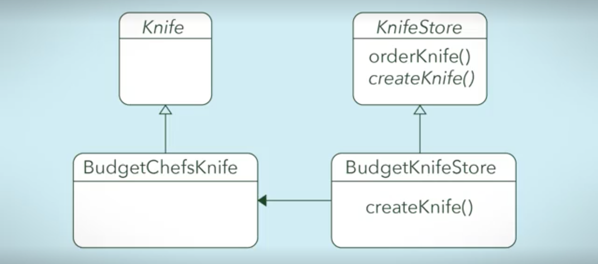
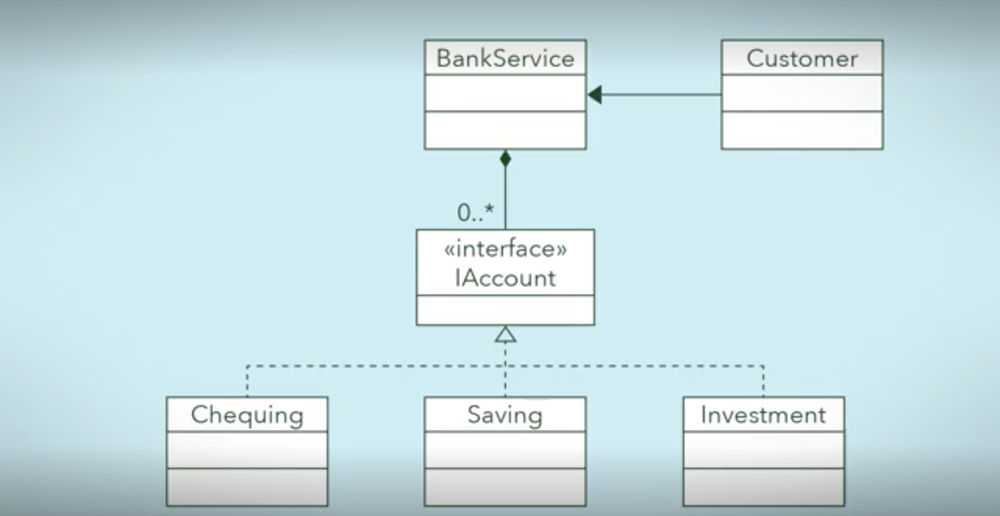
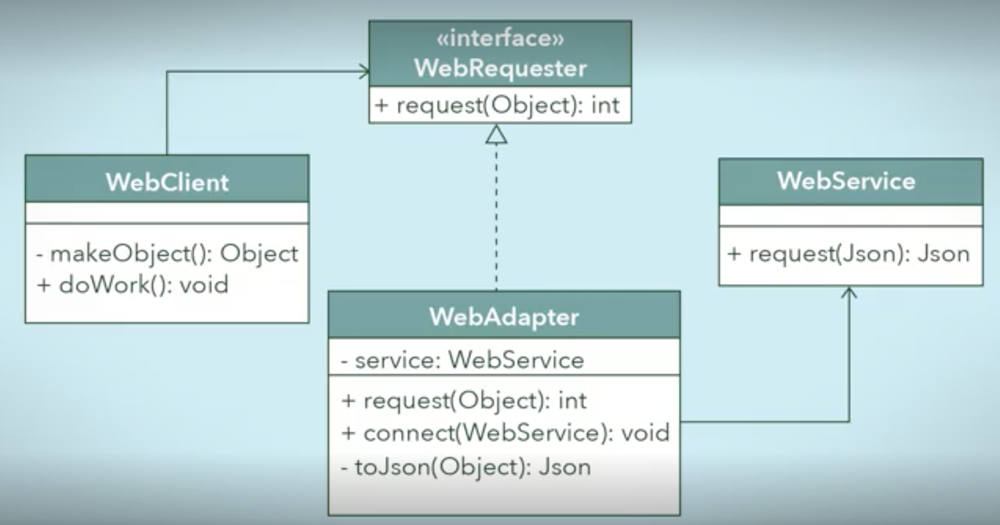
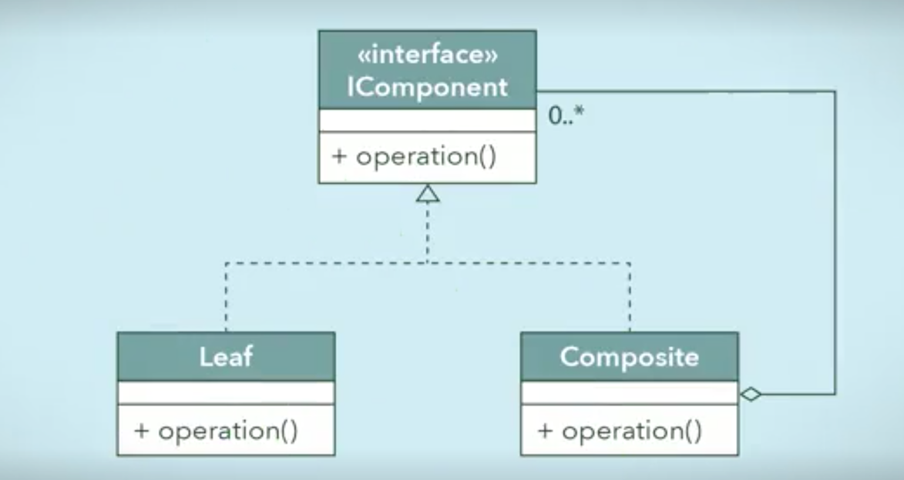
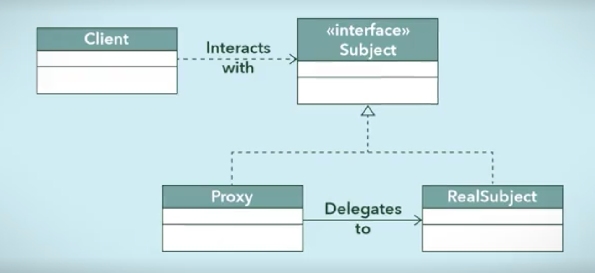
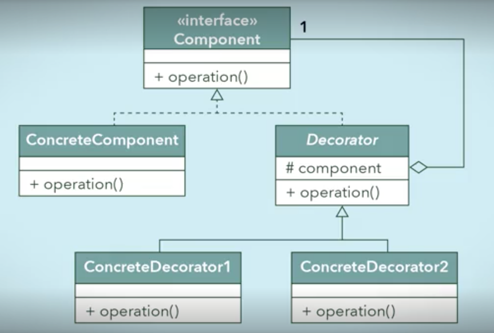
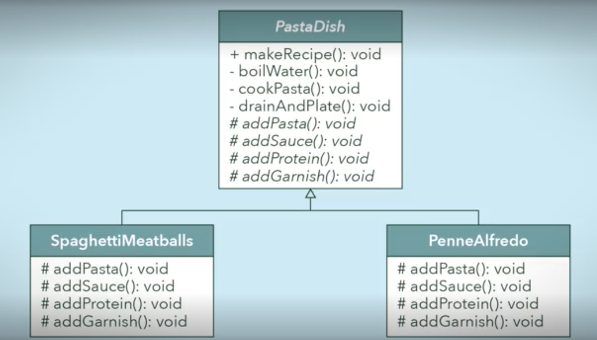

# Creational Patterns

# Singleton

- **When**: It only makes sense to have a single instance of a class in your code.

- **Example**: A game with a single Board object, or a single Configuration object.

- **What**: Design class so it's only possible to have one object of that type in your program!

- **How**:
  - Control access to the unique instance through a public static "getInstance" method (*which can also create the object the first time it is called*)

  - Make constructors private or package-private, keep one instance of the class in a private static variable, and only create and allow access to it through that public method.

# Factory Method

- **When**: A class S needs to create instances of various classes C, depending on the context.

- **Example** A knife shop orders and processes different kinds of knives (sharpen, polish, wrap). The parts can be customised by the client; there are also services to create "budget" and "luxury" versions.

- **What**: 
  - Put the code that creates C objects into a "factory" method in class S, instead of calling the constructors directly. (E.g. createKnife receives the type of handle and blade, as strings.)

  - The subclasses of S can implement the creation code differently. (E.g. S is KnifeServiceRange, it has Budget and Luxury subclasses, each of which creates a knife in budget or luxury range; they can inherit or override sharpen, polish, wrap.)

- **How**:

  - Put all the classes C under a common interface or abstract class.

  - Give class S an abstract method "createThing(...)".

  - The code of class S can now assume this method will create the appropriate C objects.

  - Each subclass of S has to implement the factory method.

  - Other code uses the appropriate subclass of S to decide which factory method is used.

- **Compare With**:

  - **Factory Object** (not exactly a design pattern) is similar to Factory Method, but the method that creates objects is moved into a separate class. E.g. KnifeFactory, BudgetKnifeFactory, LuxuryKnifeFactory.

  - This is appropriate if there are several classes that need to create the objects.

  - **Abstract Factory** pattern: A Factory object with one or more create methods, for several different kinds of related objects: a "product family". (E.g. create parts of a car.) Different product families are handled by different subclasses of the abstract factory base class. (E.g. FordFactory, HondaFactory.)

  - **Builder pattern**: Use a separate Builder object (like Factory object), but don't create objects in a single method. Instead, multiple methods can be called to construct parts of an object; and when finished, a "build" method will create and return the object. Normally the creation process is handled by a Director object.

# Structural Patterns

# Facade

- **When**: Some code has a complicated interaction with a class, or a group of subclasses/interfaces, which would be clearer if it used a simpler service to interact with them.

- **Example**: A waiter in a restaurant offers a simple interface, and takes orders to the busy kitchen.

- **Example**: A bank offers different account types (saving, current, investment); these are unified under an Account interface. A BankService talks to clents to determine which kind of account to create, and it interacts with that account for the customers.

- **How**: 
  - Create a new Facade class that provides this service.
  - It handles requests from other code, and interacts with the appropriate classes and methods.

# Adapter

- **When**: A client object needs to use a service object as if it had a particular interface, but the object's interface is different.

- E.g. either client or service may be from a third-party library, and we cannot change it.

- **Example**: A web client handles requests to send Objects, but the web service only allows Json requests.

- **What**: The client instead interacts with an Adapter object with the right interface, which wraps an instance of the target object and "translates" requests through the object's interface. (A WebAdapter takes Object requests, and tries to convert them to Json requests for the web service.)

- **How**:
  - (Create an interface that the client will use.)

  - Create an Adapter class which implements this interface.

  - The Adapter class should have a reference to the object that the client wants to interact with.

  - It should implement the desired interface and forward requests to the object.

  
# Composite

- **When**: You have "composite" objects that can contain nested instances of other objects; but you want to process both the objects and their composites with the same methods.

- **Example**: Buildings can contain multiple rooms, floors, and areas. Floors can also contain areas. Both are subdivided into rooms. But all these composites have some common functionality: You can lock and unlock a building, area, or room. You can also enter and exit them.

  
- **How**: 
  - Create a common interface for both composites and non-composite objects.
  - Composite objects can contain a collection (e.g. List) of their child objects. The composite implements the interface, possibly by forwarding requests to their children.

# Proxy

- **When**: It's less costly to interact with a "fake" or lightweight version of an object, rather than the real thing.

- **Example**: Crash test dummies when test-driving cars.

- **Example**: An online shop doesn't send orders to the warehouses directly, but instead sends them to a proxy which processes the orders and forwards them to the warehouse as needed.

- **How**:
  - A Proxy class is created which implements the same interface as the original.

  - Proxy objects have a reference to one (or more) real objects, that it forwards requests to.

- **Compare with**:
  - Flyweight Pattern: Like a Proxy, but "one instance acts as a representative for many lightweight copies". E.g. a flock of birds are "almost" duplicates of a template.)

# Decorator

- **When**: You want to be able to add several independent kinds of modification A, B, C, ... to a class's behaviour, without changing the interface. (Also without creating lots of subclasses for all the possibilities).

- **Example**: Adding authentication and/or authorisation and/or special layout to a web page, each of which changes the loading behaviour.

- **How**: 

  - Looks very similar to Composite, but the intention is different.

  - A composite wraps multiple child objects, but both composites and children behave similarly.

  - Whereas here, we use a "composite" (called Decorator) that wraps a single object, but it handles requests by doing extra things, as well as then delegating to the child object.

# Behavioural

# Template Method

- **When**: Several classes have a behaviour that follows the same steps, but each class does the steps differently.

- **Example**: Different dishes in a noodle bar involve the same steps: fetching some kind of noodles; boiling; preparing a sauce; adding protein; adding garnish. But the details of those steps differ for each dish.

- **How**:
  - Each of the steps is an abstract method in a parent class (e.g. Dish).
  - This class has a "template method" that calls the methods to follow the steps.
  - Each subclass (different Dishes) implements the steps differently.

- **Compare With**:
  - Strategy pattern: Rather than subclasses providing the implementation of the algorithm steps, this pattern uses subclasses of a Strategy class to decide which algorithm to use!

  - Builder pattern: That one is specifically about object creation. The "steps" are controlled by a separate Director object, not a template method. (And it's usually a separate Builder class.)

# Quiz of Pain

- Facade vs. Adapter vs. Proxy ?
  (vs. Flyweight)

- Template Method vs. Factory Method ?

- Factory Method vs. Abstract Factory ?

